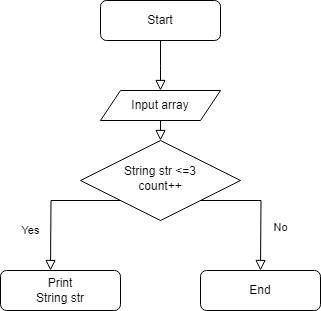

Задача в том, чтобы написать программу, которая из имеющегося массива строк формирует новый массив из строк, длина которых меньше, либо равна 3 символам. Первоначальный массив можно ввести с клавиатуры, либо задать на старте выполнения алгоритма. При решении не рекомендуется пользоваться коллекциями, лучше обойтись исключительно массивами.
Решение представлено в виде блок-схемы и создания кода на C#.

При решении задачи используется метод str.Length, который определяет, что число символов элемента массива меньше трёх, тогда программа выводит этот элемент в новый массив.
